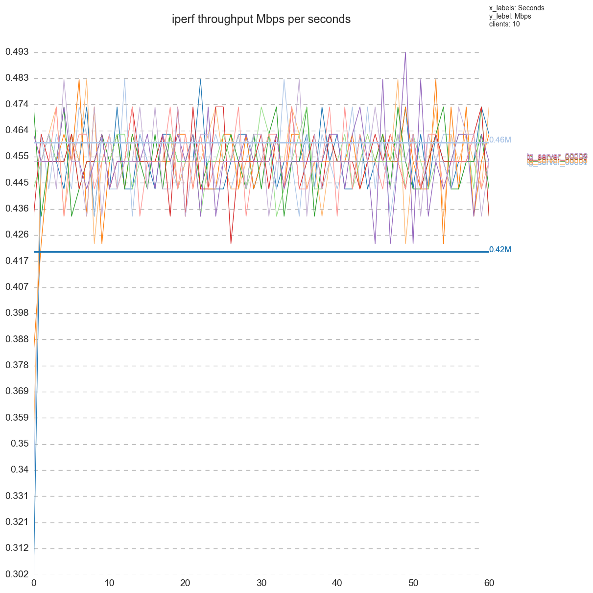
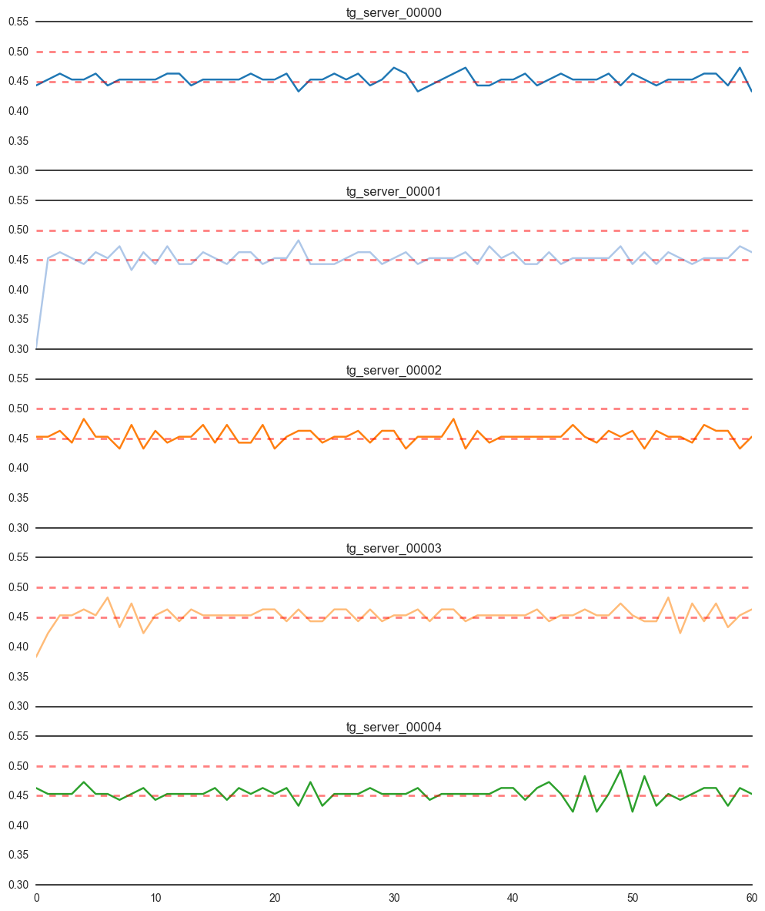
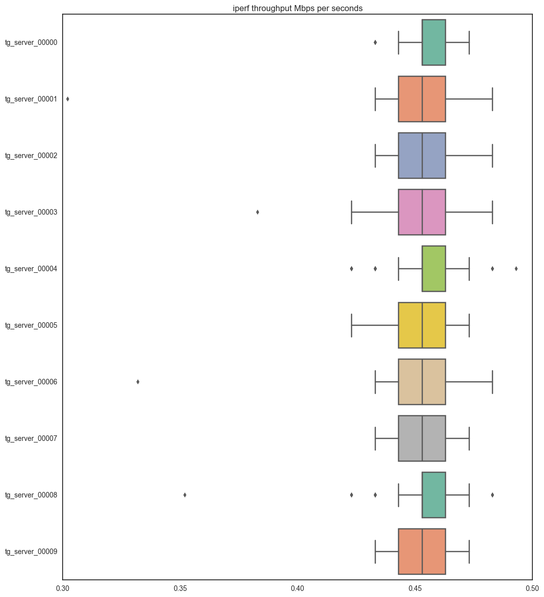

# iperfPlotter

## 1.Introduction
Iperf3 plotter is a graphing tool to generate statistical chart for iperf3 experimental result. Iperf3 output json file as result, which is not easy to view straightforwardly. This plotter will transform json data into line chart, box chart and csv file with better explanation power.

## 2.Requirements
Ipef3 plotter runs on Python, version 2.7+ and 3.3+. Plotting requires matplotlib, pandas, numpy and seaborn to be pre-installed. Replace pip wit pip3 if python3 is used.

```
pip install numpy
pip install pandas
pip install seaborn
pip install matplotlib
```

## 3.Quick start
Suppose we have prepared a folder, iperfPlot. Inside iperfPlot, we prepared two folders graph and testTarball. The testTarball contains iperf3 ouput json files named as tg_server_id.

`iperf3 -c 10.99.99.1  -Z -i 1  -A 1  -t 600 -J > tg_server_00018`

One json file corresponding to 1 iperf connection. The iperf3_plot.py will transform testTarball data into statistical charts, located in graph.

```
cheryltekiMacBook-Pro-2:iperfPlot cheryl$ tree
.
|____graph
|____iperf3_plot.py
|____testTarball
| |____tg_server_00000
| |____tg_server_00001
| |____tg_server_00002
.....
| |____tg_server_00018
| |____tg_server_00019
| |____tg_server_00020
```

Run the following command.

```
python3 iperf3_plot.py -f ./testTarball -o graph/all.png
```

In default, iperf3 plotter will generate chart, box, statistical summary and a transformed csv. 

```
cheryltekiMacBook-Pro-2:iperfPlot cheryl$ python3 iperf3_plot.py -f ./testTarball -o graph/all.png
['tg_server_00000', 'tg_server_00001', 'tg_server_00002', 'tg_server_00003', 'tg_server_00004', 'tg_server_00005', 'tg_server_00006', 'tg_server_00007', 'tg_server_00008', 'tg_server_00009', 'tg_server_00010', 'tg_server_00011', 'tg_server_00012', 'tg_server_00013', 'tg_server_00014', 'tg_server_00015', 'tg_server_00016', 'tg_server_00017', 'tg_server_00018', 'tg_server_00019', 'tg_server_00020']
cheryltekiMacBook-Pro-2:iperfPlot cheryl$ cd graph
cheryltekiMacBook-Pro-2:graph cheryl$ tree
.
|____all.png
|____all.png.csv
|____all.png_stats.csv
|____all_box.png
|____all_line_0.png
|____all_line_10.png
|____all_line_15.png
|____all_line_20.png
|____all_line_5.png
```

## 4.Configuration


```
cheryltekiMacBook-Pro-2:iperfPlot cheryl$ python3 iperf3_plot.py -h
Usage: iperf3_plot.py [ -f FOLDER | -o OUT | -p PLOTFILES | -n NOPLOTFILES | -v ]

Options:
  -h, --help            show this help message and exit
  -f FILE, --folder=FILE
                        Input folder absolute path. [Input Format: /Users/iperfExp]
  -o OUT, --output=OUT  Plot file name. [Input Format: iperf.png]
  -p PLOT_FILES, --plotfiles=PLOT_FILES
                        Choose files to be plotted. If no specified, all files in folder. [Input Format: f1,f2,f3]
  -n NO_PLOT_FILES, --noPlotFiles=NO_PLOT_FILES
                        Choose files not to be plotted. [Input Format: f1,f2,f3]
  -u UPPER_LIMIT, --upperLimit=UPPER_LIMIT
                        The expected upper boundary. [Input Format: 0.5]
  -l LOWER_LIMIT, --lowerLimit=LOWER_LIMIT
                        The expected lower boundary. [Input Format: 0.5]
  -b BOUND, --bound=BOUND
                        Provide multiple bound in pairs. [Input Format: [upperbound, lowerbound, tag]
  -v, --verbose         Verbose debug output to stderr.
```

The parameters -f and -o  are necessary, representing input source data folder and output folder respectively. 

```
python3 iperf3_plot.py -f ./testTarball -o graph/all.png
```
Iperf3 plotter provides other flexible parameters for customizing different user scenarios. We list a few example here.


- plot all lines in testTarball with boundary.
	
	```
	python3 iperf3_plot.py -f testTarball -o graph/all.png \
	-b [0.42,0.42,0.42M],[0.46,0.46,0.46M] \
	-u 0.5 -l 0.45
	```
	
	The boundary [0.42,0.42,0.42M],[0.46,0.46,0.46M] will applied on all.png. Boundary is denoted ad [upper bound,lower bound, boundary line label].
	
	The boundary 0.45 and 0.5 will applied on all_line_0.png ~ all_line_20.png. 

	The -b is only applied to ouput_filename.png while -u and -l are only applied to output_filename_id.png.

- plot only tg_server_00004,tg_server_00009 in testTarball.

	```	
	python3 iperf3_plot.py -f testTarball \
	-o graph/s49.png \
	-p tg_server_00004,tg_server_00009
	```

- plot all in testTarball except tg_server_00004,tg_client_00009 

	```	
	python3 iperf3_plot.py -f testTarball \
	-o graph/s1419.png \
	-n tg_server_00004,tg_server_00009
	```

- plot tg_server_00004,tg_server_00009 in testTarball, plot boundary on individual line.	
	
	```
	python3 iperf3_plot.py -f testTarball \
	-o graph/s49_bound.png \
	-p tg_server_00004,tg_server_00009 \
	-u 0.5 \
	-l 0.45
	```

## 5.Input Format
A sample input format can be referred at here.

```
{
    "start": {
        "timestamp": {
            "timesecs": 1489032094,
            "time": "Thu, 09 Mar 2017 04:01:34 GMT"
        },
        "system_info": "Linux localhost.localdomain 3.10.0-327.el7.x86_64 #1 SMP Thu Nov 19 22:10:57 UTC 2015 x86_64",
        "connected": [
            {
                "remote_port": 50243,
                "local_port": 50001,
                "local_host": "172.31.4.1",
                "socket": 5,
                "remote_host": "172.31.4.100"
            }
        ],
        "version": "iperf 3.1.3",
        "cookie": "localhost.localdomain.1489032286.124",
        "accepted_connection": {
            "host": "172.31.4.100",
            "port": 50202
        },
        "test_start": {
            "blksize": 131072,
            "blocks": 0,
            "bytes": 0,
            "protocol": "TCP",
            "duration": 60,
            "reverse": 0,
            "num_streams": 1,
            "omit": 0
        },
        "tcp_mss_default": 1320
    },
    ...
     "intervals": [
        {
            "streams": [
                {
                    "start": 0,
                    "end": 1.000063,
                    "socket": 5,
                    "seconds": 1.000063,
                    "omitted": false,
                    "bytes": 50160,
                    "bits_per_second": 401254.648361
                }
            ],
            "sum": {
                "start": 0,
                "end": 1.000063,
                "seconds": 1.000063,
                "omitted": false,
                "bytes": 50160,
                "bits_per_second": 401254.648361
            }
        },
        ....
|
```

Currently, iperf3 plotter only plot iperf through put in Mbps. The following code describes how iperf3 plotter calculates throughput with given input json format.

```
def generate_BW(self, iperf):
    """Do the actual formatting."""
    idx=[]
    value=[]
    duration = iperf.get('start').get('test_start').get('duration')
    for i in iperf.get('intervals'):
        for ii in i.get('streams'):
            if (round(float(ii.get('start')), 0)) <= duration:
                idx.append(round(float(ii.get('start')), 0))
                value.append(round(float(ii.get('bits_per_second')) / (1024*1024), 3))
    return pd.Series(value, index=idx)
```

## 6.Output Formats

We generate 3 types of graph: box chart, line chart and individual line chart. In addition, we also transform the json data into csv.

###6.1 Line chart
Line chart has two types: the global view and individual view.  Global view with boundaries helps user to decide whether each iperf connection throughput is inside the boundary range. The global view boundary is set by "-b".



The individual view provides better way to check, filter and inspect whether an individual connection is located inside the boundary. The individual view boundary is set by "-u" and "-l".



###6.2 box chart
Box chart and *.png_stats.csv provide a simplified view to check the variance of each connection. The shorter the bar, the less number of outliers, the result is better. In terms of iperf scenario, better result means the data transmission is more stable.


[statistic summary](graph/all.png_stats.csv)

|       | tg_server_00000      | tg_server_00001      | tg_server_00002      | tg_server_00003      | tg_server_00004      | tg_server_00005      | tg_server_00006      | tg_server_00007      | tg_server_00008     | tg_server_00009      | tg_server_00010      | tg_server_00011      | tg_server_00012      | tg_server_00013      | tg_server_00014      | tg_server_00015      | tg_server_00016      | tg_server_00017      | tg_server_00018      | tg_server_00019      | tg_server_00020      | 
|-------|----------------------|----------------------|----------------------|----------------------|----------------------|----------------------|----------------------|----------------------|---------------------|----------------------|----------------------|----------------------|----------------------|----------------------|----------------------|----------------------|----------------------|----------------------|----------------------|----------------------|----------------------| 
| count | 61.0                 | 61.0                 | 61.0                 | 61.0                 | 61.0                 | 61.0                 | 61.0                 | 61.0                 | 61.0                | 61.0                 | 61.0                 | 61.0                 | 61.0                 | 61.0                 | 61.0                 | 61.0                 | 61.0                 | 61.0                 | 61.0                 | 61.0                 | 61.0                 | 
| mean  | 0.45381967213114754  | 0.45183606557377043  | 0.45414754098360655  | 0.4525081967213115   | 0.45414754098360655  | 0.4538196721311475   | 0.4518360655737705   | 0.45365573770491807  | 0.452655737704918   | 0.453983606557377    | 0.45381967213114754  | 0.4544754098360656   | 0.4534918032786885   | 0.45299999999999996  | 0.45365573770491807  | 0.4534918032786885   | 0.45281967213114754  | 0.453655737704918    | 0.4528360655737705   | 0.453983606557377    | 0.4538196721311476   | 
| std   | 0.009182425599519466 | 0.022105188175229253 | 0.012396015577022818 | 0.015537720715321229 | 0.013428621256572064 | 0.011298242041310838 | 0.019086802008952724 | 0.010467227021998454 | 0.01760386817899373 | 0.010909463480970221 | 0.011732445321587638 | 0.010301466816877826 | 0.013469252578644534 | 0.013038404810405293 | 0.010780978999920247 | 0.011463889611616226 | 0.017653619266995758 | 0.014476285487999141 | 0.014547829537848424 | 0.011061181075091225 | 0.013453014775780819 | 
| min   | 0.433                | 0.302                | 0.433                | 0.383                | 0.423                | 0.423                | 0.332                | 0.433                | 0.352               | 0.433                | 0.433                | 0.433                | 0.403                | 0.403                | 0.433                | 0.423                | 0.352                | 0.423                | 0.373                | 0.423                | 0.423                | 
| 25%   | 0.453                | 0.443                | 0.443                | 0.443                | 0.453                | 0.443                | 0.443                | 0.443                | 0.453               | 0.443                | 0.443                | 0.453                | 0.443                | 0.443                | 0.443                | 0.443                | 0.443                | 0.443                | 0.453                | 0.453                | 0.443                | 
| 50%   | 0.453                | 0.453                | 0.453                | 0.453                | 0.453                | 0.453                | 0.453                | 0.453                | 0.453               | 0.453                | 0.453                | 0.453                | 0.453                | 0.453                | 0.453                | 0.453                | 0.453                | 0.453                | 0.453                | 0.453                | 0.453                | 
| 75%   | 0.463                | 0.463                | 0.463                | 0.463                | 0.463                | 0.463                | 0.463                | 0.463                | 0.463               | 0.463                | 0.463                | 0.463                | 0.463                | 0.463                | 0.463                | 0.463                | 0.463                | 0.463                | 0.463                | 0.463                | 0.463                | 
| max   | 0.473                | 0.483                | 0.483                | 0.483                | 0.493                | 0.473                | 0.483                | 0.473                | 0.483               | 0.473                | 0.483                | 0.483                | 0.483                | 0.483                | 0.483                | 0.483                | 0.473                | 0.483                | 0.473                | 0.483                | 0.483                | 


###6.3 Json to CSV
Iperf3 plotter also transforms json data into csv format for better viewing the numbers.

[iperf data](graph/all.png.csv)

| start | tg_server_00000 | tg_server_00001 | tg_server_00002 | tg_server_00003 | tg_server_00004 | tg_server_00005 | tg_server_00006 | tg_server_00007 | tg_server_00008 | tg_server_00009 | tg_server_00010 | tg_server_00011 | tg_server_00012 | tg_server_00013 | tg_server_00014 | tg_server_00015 | tg_server_00016 | tg_server_00017 | tg_server_00018 | tg_server_00019 | tg_server_00020 | 
|-------|-----------------|-----------------|-----------------|-----------------|-----------------|-----------------|-----------------|-----------------|-----------------|-----------------|-----------------|-----------------|-----------------|-----------------|-----------------|-----------------|-----------------|-----------------|-----------------|-----------------|-----------------| 
| 0.0   | 0.443           | 0.302           | 0.453           | 0.383           | 0.463           | 0.433           | 0.332           | 0.473           | 0.352           | 0.463           | 0.433           | 0.463           | 0.403           | 0.403           | 0.443           | 0.443           | 0.352           | 0.423           | 0.373           | 0.443           | 0.433           | 
| 1.0   | 0.453           | 0.453           | 0.453           | 0.423           | 0.453           | 0.463           | 0.463           | 0.433           | 0.453           | 0.453           | 0.443           | 0.453           | 0.443           | 0.423           | 0.433           | 0.433           | 0.463           | 0.453           | 0.453           | 0.463           | 0.453           | 
| 2.0   | 0.463           | 0.463           | 0.463           | 0.453           | 0.453           | 0.453           | 0.443           | 0.453           | 0.463           | 0.453           | 0.453           | 0.463           | 0.453           | 0.453           | 0.463           | 0.453           | 0.453           | 0.453           | 0.453           | 0.453           | 0.453           | 
| 3.0   | 0.453           | 0.453           | 0.443           | 0.453           | 0.453           | 0.453           | 0.463           | 0.453           | 0.473           | 0.473           | 0.453           | 0.443           | 0.453           | 0.453           | 0.443           | 0.463           | 0.473           | 0.453           | 0.453           | 0.453           | 0.463           | 
| 4.0   | 0.453           | 0.443           | 0.483           | 0.463           | 0.473           | 0.453           | 0.453           | 0.473           | 0.433           | 0.433           | 0.453           | 0.473           | 0.463           | 0.453           | 0.463           | 0.453           | 0.433           | 0.453           | 0.453           | 0.453           | 0.443           | 
| 5.0   | 0.463           | 0.463           | 0.453           | 0.453           | 0.453           | 0.463           | 0.443           | 0.433           | 0.463           | 0.453           | 0.453           | 0.453           | 0.463           | 0.453           | 0.473           | 0.453           | 0.463           | 0.453           | 0.463           | 0.453           | 0.463           | 
| 6.0   | 0.443           | 0.453           | 0.453           | 0.483           | 0.453           | 0.443           | 0.473           | 0.443           | 0.453           | 0.463           | 0.453           | 0.443           | 0.453           | 0.473           | 0.433           | 0.453           | 0.443           | 0.453           | 0.453           | 0.483           | 0.453           | 
| 7.0   | 0.453           | 0.473           | 0.433           | 0.433           | 0.443           | 0.453           | 0.463           | 0.453           | 0.483           | 0.463           | 0.463           | 0.453           | 0.443           | 0.443           | 0.463           | 0.463           | 0.473           | 0.453           | 0.463           | 0.423           | 0.483           | 
| 8.0   | 0.453           | 0.433           | 0.473           | 0.473           | 0.453           | 0.453           | 0.433           | 0.453           | 0.423           | 0.443           | 0.453           | 0.463           | 0.463           | 0.443           | 0.463           | 0.463           | 0.443           | 0.453           | 0.443           | 0.473           | 0.433           | 
| 9.0   | 0.453           | 0.463           | 0.433           | 0.423           | 0.463           | 0.463           | 0.463           | 0.463           | 0.453           | 0.453           | 0.463           | 0.443           | 0.463           | 0.453           | 0.443           | 0.433           | 0.463           | 0.473           | 0.453           | 0.443           | 0.453           | 
| 10.0  | 0.453           | 0.443           | 0.463           | 0.453           | 0.443           | 0.443           | 0.443           | 0.453           | 0.463           | 0.463           | 0.443           | 0.453           | 0.433           | 0.453           | 0.443           | 0.453           | 0.433           | 0.433           | 0.463           | 0.463           | 0.443           | 
| 11.0  | 0.463           | 0.473           | 0.443           | 0.463           | 0.453           | 0.453           | 0.443           | 0.463           | 0.443           | 0.443           | 0.453           | 0.473           | 0.453           | 0.483           | 0.453           | 0.453           | 0.473           | 0.483           | 0.443           | 0.433           | 0.473           | 
| 12.0  | 0.463           | 0.443           | 0.453           | 0.443           | 0.453           | 0.453           | 0.483           | 0.443           | 0.453           | 0.453           | 0.463           | 0.433           | 0.473           | 0.433           | 0.453           | 0.453           | 0.453           | 0.423           | 0.453           | 0.453           | 0.433           | 
| 13.0  | 0.443           | 0.443           | 0.453           | 0.463           | 0.453           | 0.473           | 0.433           | 0.463           | 0.453           | 0.473           | 0.463           | 0.453           | 0.443           | 0.463           | 0.453           | 0.463           | 0.443           | 0.483           | 0.473           | 0.473           | 0.453           | 
| 14.0  | 0.453           | 0.463           | 0.473           | 0.453           | 0.453           | 0.453           | 0.463           | 0.453           | 0.453           | 0.433           | 0.433           | 0.453           | 0.443           | 0.453           | 0.463           | 0.453           | 0.453           | 0.443           | 0.453           | 0.453           | 0.453           | 
| 15.0  | 0.453           | 0.453           | 0.443           | 0.453           | 0.463           | 0.453           | 0.453           | 0.443           | 0.453           | 0.453           | 0.473           | 0.463           | 0.463           | 0.443           | 0.453           | 0.463           | 0.463           | 0.463           | 0.453           | 0.453           | 0.453           | 
| 16.0  | 0.453           | 0.443           | 0.473           | 0.453           | 0.443           | 0.453           | 0.453           | 0.463           | 0.453           | 0.453           | 0.433           | 0.453           | 0.463           | 0.473           | 0.463           | 0.443           | 0.443           | 0.443           | 0.463           | 0.453           | 0.473           | 
| 17.0  | 0.453           | 0.463           | 0.443           | 0.453           | 0.463           | 0.463           | 0.453           | 0.443           | 0.453           | 0.453           | 0.463           | 0.453           | 0.453           | 0.443           | 0.443           | 0.453           | 0.463           | 0.443           | 0.453           | 0.443           | 0.443           | 
| 18.0  | 0.463           | 0.463           | 0.443           | 0.453           | 0.453           | 0.433           | 0.453           | 0.463           | 0.463           | 0.473           | 0.443           | 0.463           | 0.443           | 0.443           | 0.453           | 0.463           | 0.443           | 0.473           | 0.433           | 0.453           | 0.453           | 
| 19.0  | 0.453           | 0.443           | 0.473           | 0.463           | 0.463           | 0.473           | 0.443           | 0.453           | 0.443           | 0.443           | 0.463           | 0.443           | 0.463           | 0.453           | 0.453           | 0.443           | 0.453           | 0.443           | 0.453           | 0.463           | 0.453           | 
| 20.0  | 0.453           | 0.453           | 0.433           | 0.463           | 0.453           | 0.433           | 0.453           | 0.453           | 0.453           | 0.463           | 0.453           | 0.453           | 0.453           | 0.453           | 0.453           | 0.463           | 0.453           | 0.463           | 0.453           | 0.453           | 0.453           | 
| 21.0  | 0.463           | 0.453           | 0.453           | 0.443           | 0.463           | 0.473           | 0.463           | 0.463           | 0.453           | 0.443           | 0.453           | 0.453           | 0.443           | 0.473           | 0.453           | 0.443           | 0.463           | 0.443           | 0.463           | 0.453           | 0.453           | 
| 22.0  | 0.433           | 0.483           | 0.463           | 0.463           | 0.433           | 0.443           | 0.453           | 0.443           | 0.453           | 0.463           | 0.453           | 0.453           | 0.463           | 0.453           | 0.463           | 0.463           | 0.463           | 0.443           | 0.443           | 0.453           | 0.463           | 
| 23.0  | 0.453           | 0.443           | 0.463           | 0.443           | 0.473           | 0.443           | 0.453           | 0.453           | 0.463           | 0.443           | 0.473           | 0.473           | 0.443           | 0.453           | 0.443           | 0.443           | 0.463           | 0.463           | 0.453           | 0.453           | 0.463           | 
| 24.0  | 0.453           | 0.443           | 0.443           | 0.443           | 0.433           | 0.473           | 0.463           | 0.453           | 0.473           | 0.453           | 0.443           | 0.433           | 0.463           | 0.443           | 0.463           | 0.473           | 0.433           | 0.473           | 0.473           | 0.463           | 0.453           | 
| 25.0  | 0.463           | 0.443           | 0.453           | 0.463           | 0.453           | 0.473           | 0.453           | 0.453           | 0.453           | 0.453           | 0.443           | 0.463           | 0.453           | 0.463           | 0.453           | 0.453           | 0.463           | 0.443           | 0.433           | 0.443           | 0.433           | 
| 26.0  | 0.453           | 0.453           | 0.453           | 0.463           | 0.453           | 0.423           | 0.443           | 0.463           | 0.443           | 0.453           | 0.453           | 0.473           | 0.473           | 0.443           | 0.463           | 0.463           | 0.443           | 0.443           | 0.473           | 0.463           | 0.473           | 
| 27.0  | 0.463           | 0.463           | 0.463           | 0.443           | 0.453           | 0.453           | 0.453           | 0.453           | 0.443           | 0.473           | 0.453           | 0.433           | 0.433           | 0.463           | 0.453           | 0.463           | 0.463           | 0.453           | 0.433           | 0.443           | 0.453           | 
| 28.0  | 0.443           | 0.463           | 0.443           | 0.463           | 0.463           | 0.453           | 0.453           | 0.443           | 0.453           | 0.433           | 0.473           | 0.463           | 0.453           | 0.443           | 0.443           | 0.423           | 0.443           | 0.463           | 0.473           | 0.453           | 0.453           | 
| 29.0  | 0.453           | 0.443           | 0.463           | 0.443           | 0.453           | 0.453           | 0.463           | 0.463           | 0.453           | 0.453           | 0.443           | 0.463           | 0.453           | 0.453           | 0.463           | 0.453           | 0.453           | 0.463           | 0.453           | 0.463           | 0.443           | 
| 30.0  | 0.473           | 0.453           | 0.463           | 0.453           | 0.453           | 0.463           | 0.453           | 0.443           | 0.453           | 0.453           | 0.463           | 0.443           | 0.453           | 0.463           | 0.443           | 0.463           | 0.463           | 0.453           | 0.443           | 0.443           | 0.463           | 
| 31.0  | 0.463           | 0.463           | 0.433           | 0.453           | 0.453           | 0.443           | 0.453           | 0.463           | 0.463           | 0.463           | 0.443           | 0.443           | 0.453           | 0.443           | 0.453           | 0.443           | 0.453           | 0.433           | 0.453           | 0.463           | 0.443           | 
| 32.0  | 0.433           | 0.443           | 0.453           | 0.463           | 0.463           | 0.463           | 0.443           | 0.473           | 0.453           | 0.463           | 0.473           | 0.453           | 0.483           | 0.463           | 0.453           | 0.463           | 0.453           | 0.463           | 0.453           | 0.463           | 0.463           | 
| 33.0  | 0.443           | 0.453           | 0.453           | 0.443           | 0.443           | 0.443           | 0.483           | 0.433           | 0.453           | 0.443           | 0.453           | 0.453           | 0.423           | 0.463           | 0.453           | 0.443           | 0.473           | 0.453           | 0.453           | 0.443           | 0.443           | 
| 34.0  | 0.453           | 0.453           | 0.453           | 0.463           | 0.453           | 0.473           | 0.453           | 0.453           | 0.473           | 0.473           | 0.463           | 0.453           | 0.453           | 0.473           | 0.453           | 0.473           | 0.463           | 0.453           | 0.453           | 0.453           | 0.463           | 
| 35.0  | 0.463           | 0.453           | 0.483           | 0.463           | 0.453           | 0.443           | 0.433           | 0.453           | 0.463           | 0.443           | 0.433           | 0.463           | 0.463           | 0.433           | 0.483           | 0.453           | 0.423           | 0.463           | 0.453           | 0.453           | 0.453           | 
| 36.0  | 0.473           | 0.463           | 0.433           | 0.443           | 0.453           | 0.453           | 0.463           | 0.473           | 0.443           | 0.443           | 0.443           | 0.453           | 0.463           | 0.443           | 0.453           | 0.453           | 0.463           | 0.443           | 0.453           | 0.463           | 0.453           | 
| 37.0  | 0.443           | 0.443           | 0.463           | 0.453           | 0.453           | 0.463           | 0.443           | 0.433           | 0.453           | 0.453           | 0.463           | 0.453           | 0.443           | 0.453           | 0.433           | 0.443           | 0.453           | 0.453           | 0.453           | 0.443           | 0.483           | 
| 38.0  | 0.443           | 0.473           | 0.443           | 0.453           | 0.453           | 0.443           | 0.463           | 0.453           | 0.433           | 0.453           | 0.453           | 0.463           | 0.453           | 0.453           | 0.463           | 0.453           | 0.453           | 0.453           | 0.473           | 0.463           | 0.423           | 
| 39.0  | 0.453           | 0.453           | 0.453           | 0.453           | 0.463           | 0.463           | 0.453           | 0.463           | 0.453           | 0.473           | 0.443           | 0.443           | 0.453           | 0.453           | 0.443           | 0.463           | 0.443           | 0.453           | 0.463           | 0.443           | 0.463           | 
| 40.0  | 0.453           | 0.463           | 0.453           | 0.453           | 0.463           | 0.453           | 0.443           | 0.453           | 0.453           | 0.433           | 0.463           | 0.453           | 0.453           | 0.453           | 0.453           | 0.463           | 0.463           | 0.453           | 0.433           | 0.453           | 0.453           | 
| 41.0  | 0.463           | 0.443           | 0.453           | 0.453           | 0.443           | 0.453           | 0.453           | 0.453           | 0.453           | 0.473           | 0.453           | 0.453           | 0.453           | 0.463           | 0.453           | 0.443           | 0.453           | 0.453           | 0.453           | 0.483           | 0.453           | 
| 42.0  | 0.443           | 0.443           | 0.453           | 0.463           | 0.463           | 0.453           | 0.473           | 0.453           | 0.453           | 0.443           | 0.463           | 0.453           | 0.453           | 0.453           | 0.463           | 0.453           | 0.453           | 0.453           | 0.453           | 0.433           | 0.453           | 
| 43.0  | 0.453           | 0.463           | 0.453           | 0.443           | 0.473           | 0.443           | 0.443           | 0.453           | 0.453           | 0.463           | 0.453           | 0.453           | 0.453           | 0.463           | 0.443           | 0.453           | 0.453           | 0.483           | 0.463           | 0.453           | 0.473           | 
| 44.0  | 0.463           | 0.443           | 0.453           | 0.453           | 0.453           | 0.453           | 0.473           | 0.453           | 0.463           | 0.453           | 0.443           | 0.463           | 0.463           | 0.453           | 0.453           | 0.443           | 0.453           | 0.423           | 0.453           | 0.453           | 0.423           | 
| 45.0  | 0.453           | 0.453           | 0.473           | 0.453           | 0.423           | 0.463           | 0.443           | 0.453           | 0.453           | 0.453           | 0.453           | 0.443           | 0.443           | 0.453           | 0.463           | 0.473           | 0.473           | 0.473           | 0.443           | 0.453           | 0.463           | 
| 46.0  | 0.453           | 0.453           | 0.453           | 0.463           | 0.483           | 0.453           | 0.463           | 0.463           | 0.453           | 0.443           | 0.473           | 0.483           | 0.463           | 0.453           | 0.463           | 0.443           | 0.433           | 0.483           | 0.453           | 0.453           | 0.453           | 
| 47.0  | 0.453           | 0.453           | 0.443           | 0.453           | 0.423           | 0.463           | 0.433           | 0.443           | 0.453           | 0.463           | 0.443           | 0.443           | 0.453           | 0.453           | 0.453           | 0.463           | 0.463           | 0.453           | 0.453           | 0.453           | 0.463           | 
| 48.0  | 0.463           | 0.453           | 0.463           | 0.453           | 0.453           | 0.453           | 0.453           | 0.473           | 0.483           | 0.453           | 0.443           | 0.443           | 0.463           | 0.453           | 0.443           | 0.453           | 0.443           | 0.433           | 0.473           | 0.453           | 0.443           | 
| 49.0  | 0.443           | 0.473           | 0.453           | 0.473           | 0.493           | 0.443           | 0.453           | 0.453           | 0.423           | 0.443           | 0.453           | 0.453           | 0.443           | 0.453           | 0.463           | 0.453           | 0.453           | 0.433           | 0.453           | 0.453           | 0.463           | 
| 50.0  | 0.463           | 0.443           | 0.463           | 0.453           | 0.423           | 0.463           | 0.463           | 0.443           | 0.453           | 0.463           | 0.473           | 0.463           | 0.463           | 0.473           | 0.453           | 0.443           | 0.453           | 0.463           | 0.443           | 0.463           | 0.443           | 
| 51.0  | 0.453           | 0.463           | 0.433           | 0.443           | 0.483           | 0.443           | 0.443           | 0.443           | 0.453           | 0.443           | 0.443           | 0.453           | 0.443           | 0.443           | 0.453           | 0.453           | 0.453           | 0.443           | 0.463           | 0.453           | 0.463           | 
| 52.0  | 0.443           | 0.443           | 0.463           | 0.443           | 0.433           | 0.453           | 0.453           | 0.453           | 0.453           | 0.463           | 0.483           | 0.443           | 0.453           | 0.453           | 0.463           | 0.453           | 0.463           | 0.453           | 0.453           | 0.443           | 0.443           | 
| 53.0  | 0.453           | 0.463           | 0.453           | 0.483           | 0.453           | 0.463           | 0.453           | 0.463           | 0.473           | 0.463           | 0.433           | 0.453           | 0.453           | 0.443           | 0.443           | 0.453           | 0.473           | 0.473           | 0.453           | 0.453           | 0.483           | 
| 54.0  | 0.453           | 0.453           | 0.453           | 0.423           | 0.443           | 0.453           | 0.463           | 0.473           | 0.433           | 0.443           | 0.453           | 0.463           | 0.463           | 0.453           | 0.443           | 0.453           | 0.433           | 0.433           | 0.453           | 0.463           | 0.443           | 
| 55.0  | 0.453           | 0.443           | 0.443           | 0.473           | 0.453           | 0.453           | 0.463           | 0.443           | 0.463           | 0.453           | 0.453           | 0.463           | 0.483           | 0.453           | 0.463           | 0.453           | 0.463           | 0.453           | 0.463           | 0.453           | 0.433           | 
| 56.0  | 0.463           | 0.453           | 0.473           | 0.443           | 0.463           | 0.453           | 0.443           | 0.443           | 0.453           | 0.453           | 0.443           | 0.443           | 0.423           | 0.453           | 0.443           | 0.473           | 0.453           | 0.463           | 0.433           | 0.453           | 0.463           | 
| 57.0  | 0.463           | 0.453           | 0.463           | 0.473           | 0.463           | 0.453           | 0.453           | 0.453           | 0.463           | 0.453           | 0.453           | 0.453           | 0.453           | 0.463           | 0.463           | 0.453           | 0.453           | 0.453           | 0.463           | 0.453           | 0.453           | 
| 58.0  | 0.443           | 0.453           | 0.463           | 0.433           | 0.433           | 0.463           | 0.453           | 0.453           | 0.453           | 0.463           | 0.453           | 0.453           | 0.453           | 0.443           | 0.453           | 0.443           | 0.463           | 0.473           | 0.443           | 0.473           | 0.453           | 
| 59.0  | 0.473           | 0.473           | 0.433           | 0.453           | 0.463           | 0.473           | 0.453           | 0.463           | 0.443           | 0.443           | 0.463           | 0.463           | 0.463           | 0.483           | 0.483           | 0.483           | 0.443           | 0.453           | 0.463           | 0.433           | 0.473           | 
| 60.0  | 0.433           | 0.463           | 0.453           | 0.463           | 0.453           | 0.433           | 0.453           | 0.443           | 0.473           | 0.453           | 0.473           | 0.463           | 0.473           | 0.453           | 0.433           | 0.423           | 0.473           | 0.453           | 0.463           | 0.463           | 0.443           | 


## 7.Run robot framework test

```
robot --loglevel DEBUG iperf3_plot.robot
```